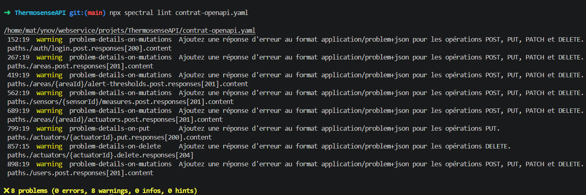

## Règles de gates

| Si...                                                       | Alors...                       | Outil / moment de controle                 |
| ----------------------------------------------------------- | ------------------------------ | ------------------------------------------ |
| le lint sur le fichier Contrat-openapi.yaml echoue          | bloquer le merge               | lint ci sur les mr                         |
| Si le contrat openapi change                                | le changelog doit être modifié | verification de la modification dans la ci |
| Un secret ou token réel apparaît dans un example du contrat | Merge bloqué                   | ci verify                                  |

## Lint OpenAPI

| Regle                                                                             | Pourquoi pour notre projet fil rouge                                                        |
| --------------------------------------------------------------------------------- | ------------------------------------------------------------------------------------------- |
| regle sur le formatage du fichier                                                 | assurer la qualité du contrat                                                               |
| Regle sur les erreurs du fichier                                                  | assurer que le contrat soit toujours fonctionnel et disponible                              |
| Pour chaque route, avoir un exemple des codes retours possible                    | permet d'assurer la qualité de l'intégration et le suivi dans le cas d'erreurs              |
| Verification sur l'endpoint pour savoir s'il doit etre au singulier ou au pluriel | permet d'assurer la qualité et d'avoir une clareté sur les endpoints et leur fonctionnement |

## Test de contrat

| Champ                         | Réponse                                                                                      |
| ----------------------------- | -------------------------------------------------------------------------------------------- |
| Approche                      | tests maisons sur openApi, tests avec Postamn et tests automatiques                          |
| ENdpoint couverts en priorité | login car obligatoire pour avoir le token, et sur les POST critiques ( capteurs / mesures ). |
| Fréquence                     | Chaque PR et Manuel avant release                                                            |
| Preuve attendue en dépot      | Rapport CI et dans un fichier tests/resultats pour prouver que les tests sont corrects       |

## Breaking change & versioning

| Champ                         | Réponse                                                                                                            |
| ----------------------------- | ------------------------------------------------------------------------------------------------------------------ |
| Méthode de détection          | etag dans la preview de l'header http                                                                              |
| Changements considérés        | Suppresion du champs required, renommage, changement de type, changement de code http semantique et réduction énum |
| Processus si breaking détecté | changement d'etag                                                                                                  |

Aucun merge sur main qui introduit un breaking change sans un fichier changelog qui note les changements et une montée
de version (ex v1 à v2 ) dans le etag

## Sécurité dans la pipeline

| Contrôle                                                | Activé ? | Détail                                                                                                                                                                                                                         |
| ------------------------------------------------------- | :------: | ------------------------------------------------------------------------------------------------------------------------------------------------------------------------------------------------------------------------------ |
| Pas de secret dans le contrat / exemples                |   non    | Règle Spectral custom `no-real-tokens` qui rejette tout `example` contenant `eyJ[A-Za-z0-9_-]{20,}\.eyJ` (JWT réel) ou `password`/`secret` en clair ; tokens d'exemple sont des **fakes vraisemblables** documentés comme tels |
| `securitySchemes` présents sur endpoints protégés       |   non    | `BearerAuth` (JWT) déclaré dans `components.securitySchemes` ; appliqué globalement via `security: [BearerAuth]` ; override `security: []` uniquement sur `/health`, `POST /auth/login`, `POST /users` (création de compte)    |
| Pas de régression sur tests sécurité existants (Note 2) |   non    | Job CI : `npm run test:auth && npm run test:cadrage` — couvre 23 scénarios RBAC/BOLA documentés dans `Rendu/10-matrice-autorisations.md`                                                                                       |
| Scan dépendances                                        |   non    | `npm audit --audit-level=high` dans le job CI — bloque sur vulnérabilité HIGH ou CRITICAL                                                                                                                                      |

## Critères avant push/merge

- **Lint OpenAPI vert** (`spectral lint` 0 erreur)
- **Tests de contrat verts sur endpoints critiques** (`schemathesis` sur les 3 endpoints prioritaires — voir §3)
- **Pas de breaking change non documenté** (`oasdiff breaking` 0 changement breaking sans bump)
- **Revue pair sur diff du contrat** (PR ≥ 1 reviewer ; le diff `contrat-openapi.yaml` est lu ligne à ligne par un
  membre n'ayant pas écrit le commit)
- **CHANGELOG ou note de version mise à jour** (si le contrat a changé, `CHANGELOG.md` doit avoir une entrée datée — à
  créer)
- **Tests RBAC/BOLA verts** (`npm run test:auth && npm run test:cadrage`)

**Responsable du gate (rôle) :** Tout merge sur `main` touchant `contrat-openapi.yaml` passe par **un rôle de « contract
owner » tournant**. Le contract owner valide le respect du gate ; en son absence, blocage par défaut. Pas de nom
hardcodé pour éviter le bus factor.

## Limites assumées

| Non couvert                                                                                     | Pourquoi / quand le lever                                                                                                                                                    |
| ----------------------------------------------------------------------------------------------- | ---------------------------------------------------------------------------------------------------------------------------------------------------------------------------- |
| Validation du **WSDL** `extrait-contrait-wsdl-note3.xml` (BillingService SOAP)                  | Hors périmètre fil rouge — le WSDL est documentaire (livrable Note 3 L1), pas un contrat exécuté. Ajout `xmllint --noout --schema xsd` prévu si la facturation passe en POC. |
| Cohérence sémantique **OpenAPI ↔ implémentation Express** (`src/routes/`)                       | Une route déclarée dans le YAML mais non implémentée passe le lint. Mitigation : tests de contrat Schemathesis (§3) en cours de mise en place — couverture partielle prévue. |
| Règles Spectral custom (`problem-details-on-mutations`, `typed-parameters`, `string-maxlength`) | À écrire dans `spectral.yaml`. Ruleset minimal viable d'ici là : `spectral:oas` standard.                                                                                    |
| Tests de charge / SLA                                                                           | Non documenté dans le contrat. Hors périmètre Note 3 (`Rendu/07-evaluation.md` documente cette limite).                                                                      |
| Détection de **secrets dans l'historique git** (et pas seulement dans le HEAD)                  | Audit ponctuel `git-secrets` ou `trufflehog` non automatisé. À ajouter si le repo s'ouvre à l'externe.                                                                       |

## Preuves pour la note 3

- capture d'écran lint : 

- Lien de notre gate qui passe : https://github.com/Aairuxul/ThermosenseAPI/pull/1
