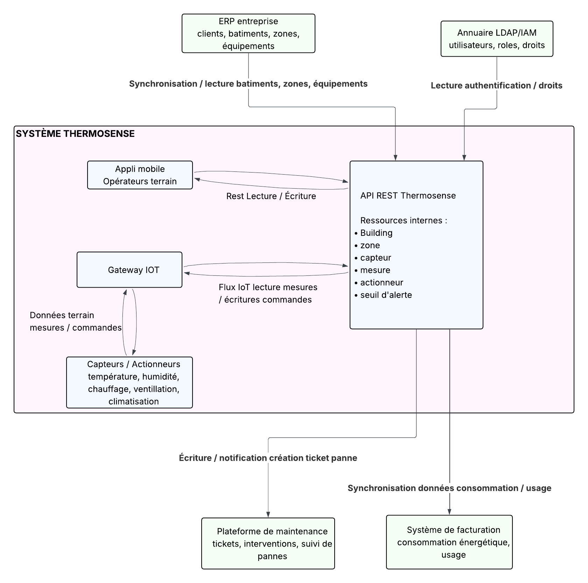

# Rendu de la note 3- Architecture SOA/SOAP et gouvernance API

## Rendu 1 - Note d'architecture SOA/SOAP

### 1.1 -- Cartographie du système étendu

### 1.2 -- Analyse des besoin d'intégration

| Intégration | Contrainte principale | REST suffisant ? | SOAP/SOA pertinent ? | Justification |
| --- | --- | --- | --- | --- |
| ERP entreprise | Outil sécurisé/privé dont il faudra analyser comment lui converser avec lui | Oui | non | car pas de capacité métier facilement identifiable |
| Annuaire LDAP/IAM | faut que ce soit sécurisé et bien géré | Oui | Non | Systèmes utilisés récent et utilisant déjà du REST |
| Système de facturation | vieux systèmes | Oui | Oui | Capacité métier est identifiable, il peut être autonome dans son cycle de vie et il est propriétaire de sa donnée |
| Plateforme de maintenance | Disponibilité, fiable | Oui | Non | pas autonome dans le cycle de vie et contrat pas stable |

### 1.3 -- Proposition d'architecture argumentée 

#### Cas d'intégration retenue

L'intégration proposée pour un approche SOA/SOAP est le système de facturation. Il sera une application legacy propriétaire opérée en interne qui gère le cycle complet de génération et d'archivage des factures client. Notre API doit transmettre les événements de monitoring et d'alertes (dépassements de seuils, maintenances d'équipements par exemple) au système de facturation pour déclencher la création des lignes de facturation correspondantes. L'intégration répond à un besoin métier qui est d'assurer une traçabilité transactionnelle entre les incidents détectés et les frais associés. La contrainte déclenchante est imposée par l'audit et la conformité financière exigeant un service de facturation stable, autonome et responsable de ses données, justifiant l'adoption d'une approche SOA avec SOAP pour garantir les contrats formels et la non-répudiation des échanges.

#### Choix d'architecture

Intégration d'un service de facturation avec une architecture REST côté app mobile + SOAP côté partenaire via proxy.

#### Justification

1. Systemes de facturation déjà existant sont déjà présents et basés sur des vieux modèles. son contrat est accesible que par une seul point de contact que l'on doit utiliser pour communiquer avec l'application mobile. Si nous avions utilisé REST, il aurait fallut modifier nos endpoints pour qu'ils correspondent à ce qui existe sur l'interface du partenaire

2. le systeme de données ne concerne que lui. Sa capacité métier est identifiable, ce qui fait qu'il s'auto-gère et qu'il est autonome. Si nous avions du utiliser REST, il aurait fallut séparer en plusieurs modules.
3. Le système de données est propriétaire de ses données. Il n'appartient qu'à lui et nous lui envoyons/ recevons juste des informations pour qu'il puisse s'agrémenter. Avec REST, il aurait surement fallut regrouper plusieurs types de données en un pour faire des factures.

#### Limites et incertitudes

- On ne sait pas encore le type de données exacts qui seront transmises (savoir si ce qu'on a correspond a ce qu'ils veulent recevoir)
- Il faudrait chiffrer les couts d'éventuelles modifications de nos schémas de données pour coller avec le besoin du partenaire
- Est-ce que l'équipe sait travailler avec leur technologie en cas de problème. Dans le cas contraire les couts pourraient augmenter et formations/ recrutement
- La limite temporel dans le cas ou SOA/SOAP n'est plus utilisé ou abandonné par le partenaire

### 1.4 - Comparaison REST vs. SOA/SOAP sur notre cas

| Critère | API REST actuelle |Approche SOA/SOAP envisagée |
| --- | --- | --- |
| Formalisme du contrat | séparation claire des services, utilisation d'OpenAPI | vieux xml moches |
| Testabilité | Postman + tests | Postman + tests automatisés |
| Évolutivité | ajout de services avec des routes | ajout d'un service a connecter a la route de base |
| Complexité d'intégration | super simple | Compliqué |
| Gouvernance | Séparation des responsabilité par service et gouvernance plus personnalisable | gouvernance stricte et à respecter |